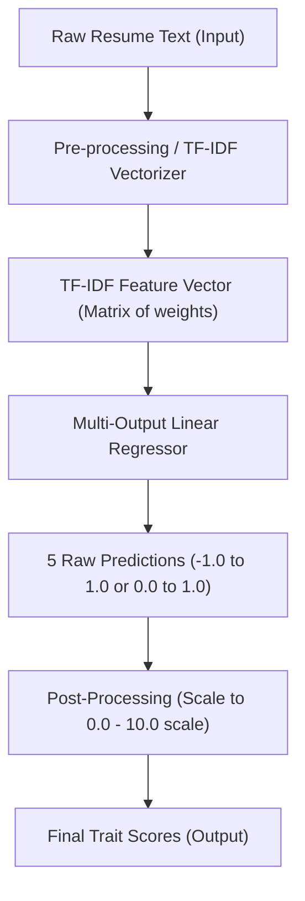

# Technical Report: End-to-End Machine Learning Algorithm

This document provides a detailed breakdown of how the **Personality AI Predictor** converts raw resume text into predicted Big Five (OCEAN) personality scores.

---

## 1. High-Level Architecture Overview

The system operates as a classic supervised natural language processing (NLP) pipeline. It converts unstructured text into numerical features, feeds those features into a regression model, and maps the output back to a human-readable scale.

---

## 2. Text Representation: TF-IDF Vectorization

Computers cannot process raw text directly; words must be converted into numerical representation. This pipeline uses **Term Frequency-Inverse Document Frequency (TF-IDF)**.

### How TF-IDF Works:
1.  **Term Frequency (TF)**: Measures how frequently a word appears in a single resume.
    $$\text{TF}(t, d) = \frac{\text{Number of times term } t \text{ appears in document } d}{\text{Total number of terms in document } d}$$
2.  **Inverse Document Frequency (IDF)**: Measures how common or rare a word is across *all* resumes in the training dataset. If a word (like "the" or "and") appears in every resume, its IDF is very low because it doesn't help distinguish one resume from another.
    $$\text{IDF}(t, D) = \log \left( \frac{\text{Total number of documents } D}{\text{Number of documents containing term } t} \right)$$
3.  **TF-IDF Score**: The final weight is the product of TF and IDF.
    $$\text{TF-IDF}(t, d, D) = \text{TF}(t, d) \times \text{IDF}(t, D)$$

This results in a **vocabulary vector** where each element corresponds to a specific word. Words that are highly characteristic of a candidate's background (e.g., "leader", "organized", "analytical") receive high weights, whereas generic English words are ignored using built-in `stop_words='english'`.

---

## 3. The Prediction Model: Multi-Output Regression

Because we want to predict **five separate continuous scores** (one for each OCEAN trait) simultaneously from a single input, we use a **Multi-Output Regressor wrapper** wrapped around a **Linear Regression** algorithm.

### Math Behind the Prediction:
The model fits 5 separate linear equations, one for each trait $i \in \{1, 2, 3, 4, 5\}$:

$$Y_{\text{trait}_i} = w_{i,1} x_1 + w_{i,2} x_2 + \dots + w_{i,N} x_N + b_i$$

Where:
*   $Y_{\text{trait}_i}$ is the predicted score for a specific trait (e.g., Openness).
*   $x_1, x_2, \dots, x_N$ are the TF-IDF weights of the words present in the resume.
*   $w_{i,1}, w_{i,2}, \dots, w_{i,N}$ are the **model weights** (coefficients) learned during training.
*   $b_i$ is the bias (intercept) term for that trait.

### How it "finds" the traits:
During training on the labeled dataset, the Linear Regression optimizer adjusts the weights ($w$) to minimize the prediction error. 
*   **Positive Coefficients**: Words like `"leader"`, `"creative"`, `"innovated"`, and `"public"` will receive positive weights for traits like **Extraversion** or **Openness**.
*   **Negative Coefficients**: Words representing disorder or high stress could receive negative weights for **Conscientiousness** or positive weights for **Neuroticism**.

---

## 4. End-to-End Processing Walkthrough

When a user submits a resume (either pasting it or selecting a row), the following sequence runs in [src/app.py](file:///e:/projects%20from%20desktops/codeclause2/src/app.py):

1.  **Input Extraction**: The text string is retrieved from the Streamlit text area or CSV column.
2.  **Vectorization**: The fitted `tfidf_vectorizer.joblib` transforms the text into a numerical sparse matrix of shape `(1, Vocabulary_Size)`.
3.  **Regression Inference**: The `personality_model.joblib` MultiOutputRegressor predicts a raw array of 5 continuous values.
4.  **Scaling & Capping**:
    Since the raw prediction values usually lie between $-1.0$ and $+1.0$, they are scaled to a standard $0$ to $10$ range for intuitive user understanding:
    $$\text{Score} = \text{clamp} \left( (\text{Prediction} + 1.0) \times 5, \text{min}=0.0, \text{max}=10.0 \right)$$
5.  **Rendering**: The progress bars and trait scores are rendered in the streamlit dashboard.
